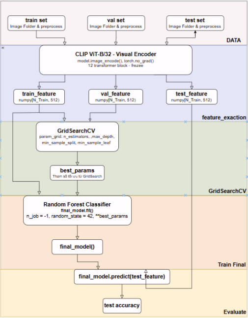

# Phương pháp Contrastive Language-Image Pre-training

CLIP (Contrastive Language–Image Pretraining) là mô hình được OpenAI giới thiệu vào năm 2021, có khả năng học đồng thời từ hai dạng dữ liệu là hình ảnh và văn bản. Điểm nổi bật của CLIP là khả năng zero-shot learning, cho phép mô hình thực hiện phân loại mà không cần huấn luyện lại trên dataset cụ thể, chỉ thông qua các mô tả văn bản (text prompt).

Về kiến trúc, CLIP bao gồm hai thành phần chính:

- Text Encoder: sử dụng Transformer để mã hóa văn bản thành vector đặc trưng.
- Image Encoder: sử dụng các backbone như Vision Transformer (ViT) hoặc ResNet để trích xuất đặc trưng từ ảnh.

CLIP được huấn luyện trên khoảng 400 triệu cặp ảnh–văn bản thu thập từ Internet bằng phương pháp học tương phản (contrastive learning). Trong quá trình này, mô hình học cách tối đa hóa độ tương đồng giữa các cặp ảnh–văn bản đúng (matching pairs) và tối thiểu hóa độ tương đồng với các cặp không tương ứng (non-matching pairs).

Sau giai đoạn tiền huấn luyện (pre-training), CLIP có thể được sử dụng cho bài toán phân loại bằng cách chuyển các nhãn lớp thành các câu mô tả (ví dụ: “a photo of a <object>”). Các câu này được đưa qua Text Encoder để tạo vector biểu diễn. Đồng thời, ảnh cần phân loại được đưa qua Image Encoder để thu được vector đặc trưng. Kết quả dự đoán được xác định dựa trên độ tương đồng (thường là cosine similarity) giữa vector ảnh và các vector văn bản, trong đó lớp có độ tương đồng cao nhất sẽ được chọn.
Trong bài toán này, CLIP là một bộ rút trích đặc trưng — tức là chỉ lấy phần Image Encoder, bỏ hoàn toàn phần Text Encoder. Vector đặc trưng 512 chiều thu được sẽ được đưa vào Random Forest để phân loại. Điều này cho kết quả tốt hơn zero-shot vì mô hình được train trực tiếp trên nhãn chính xác.
# Sơ đồ các giai đoạn huấn luyện mô hình

Thực hiện huấn luyện mô hình trên tập dataset không và được tăng cường dữ liệu. Kết quả huấn luyên được thể thiện qua bảng sau 
|ĐỘ ĐO |CÓ AUGMENTATION | KHÔNG AUGMENTAION |
|---------|----------------|-------------------|
|Accuracy  | 0.9078 | 0.9038 |
|Precision | 0.9126 | 0.9096 |
|Recall    | 0.9085 | 0.9036 | 
|Macro F1  | 0.9081 | 0.9040 |
     
Đánh giá: 
- Mô hình CLIP kết hợp Random Forest đạt hiệu suất khá cao với Accuracy đạt 0.9078 khi sử dụng data augmentation và 0.9038 khi không sử dụng. Các chỉ số Precision, Recall và Macro F1-score đều ở mức trên 0.90 và có sự chênh lệch không đáng kể giữa hai trường hợp.
- Việc áp dụng data augmentation giúp cải thiện nhẹ hiệu suất mô hình trên tất cả các chỉ số, cho thấy mô hình có khả năng tổng quát hóa tốt hơn khi được huấn luyện trên dữ liệu đa dạng hơn. Tuy nhiên, mức cải thiện không lớn, cho thấy đặc trưng trích xuất từ CLIP đã đủ mạnh để mô hình học hiệu quả ngay cả khi không sử dụng augmentation.
- Tổng thể, mô hình CLIP + Random Forest là một giải pháp hiệu quả cho bài toán phân loại, vừa tận dụng được khả năng biểu diễn mạnh của CLIP, vừa đảm bảo tính đơn giản và hiệu quả của bộ phân loại Random Forest.